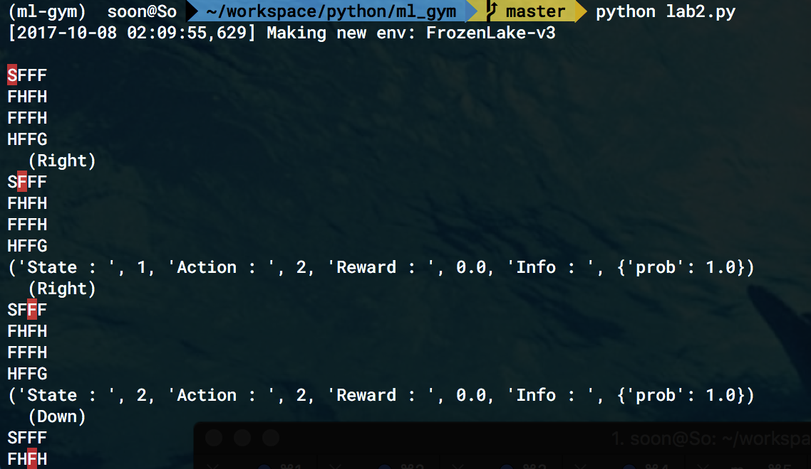

# ml_gym


[강의 페이지 : ]()  

1) [강의 목차, youtube link 정리된곳](http://hunkim.github.io/ml/)  

2) [인프런](https://www.inflearn.com/course/%EA%B8%B0%EB%B3%B8%EC%A0%81%EC%9D%B8-%EB%A8%B8%EC%8B%A0%EB%9F%AC%EB%8B%9D-%EB%94%A5%EB%9F%AC%EB%8B%9D-%EA%B0%95%EC%A2%8C/)

https://www.inflearn.com/course/%EA%B8%B0%EB%B3%B8%EC%A0%81%EC%9D%B8-%EB%A8%B8%EC%8B%A0%EB%9F%AC%EB%8B%9D-%EB%94%A5%EB%9F%AC%EB%8B%9D-%EA%B0%95%EC%A2%8C/

  


- [1강](http://hunkim.github.io/ml/RL/rl01.pdf)  
- [2강](http://hunkim.github.io/ml/RL/rl02.pdf)  
- [lab2 (2강 실습)](http://hunkim.github.io/ml/RL/rl-l02.pdf)  
  결과화면  
  
  [Agent의 움직임에 따라 Q table을 작성하는 코드를 실습해본 유저블로그](http://passi0n.tistory.com/82)  
  [Q-Learning 알고리즘 이용하는 코드 작성한 유저 블로그](http://passi0n.tistory.com/83)  
  ​
- aws 관련설정 등에 대해 설명된 pdf
  [텐서플로우 GPU](http://hunkim.github.io/ml/lab13.pdf)  
  [텐서플로우 GPU spot instance](http://hunkim.github.io/ml/lab14-aws_spot_instance.pdf)  
- ​

## 환경설정

### lab2 > just sample program, Coding is Not yet.

강좌에 설명된데로 tensorflow, gym만 필요한 것이 아니고 scipy가 필요하다. 혹시나 해서 numpy가 안깔려있을까 싶어 추가했고(tensorflow내에 이미 있을텐데…ㅋㅋ) pandas도 어차피 나중에 사용하게 될테니 설치했다. 이 외에 bpython은 콘솔에서 자동완성이 되도록 도와주는 유틸이다.  

```shell
$ cd
$ cd workspace/env
$ virtualenv ml-gym
$ source ml-gym/bin/activate
$ pip install tensorflow
$ pip install bpython
$ pip install gym
$ pip install scipy
$ pip install numpy
$ pip install pandas
$ bpython
```


